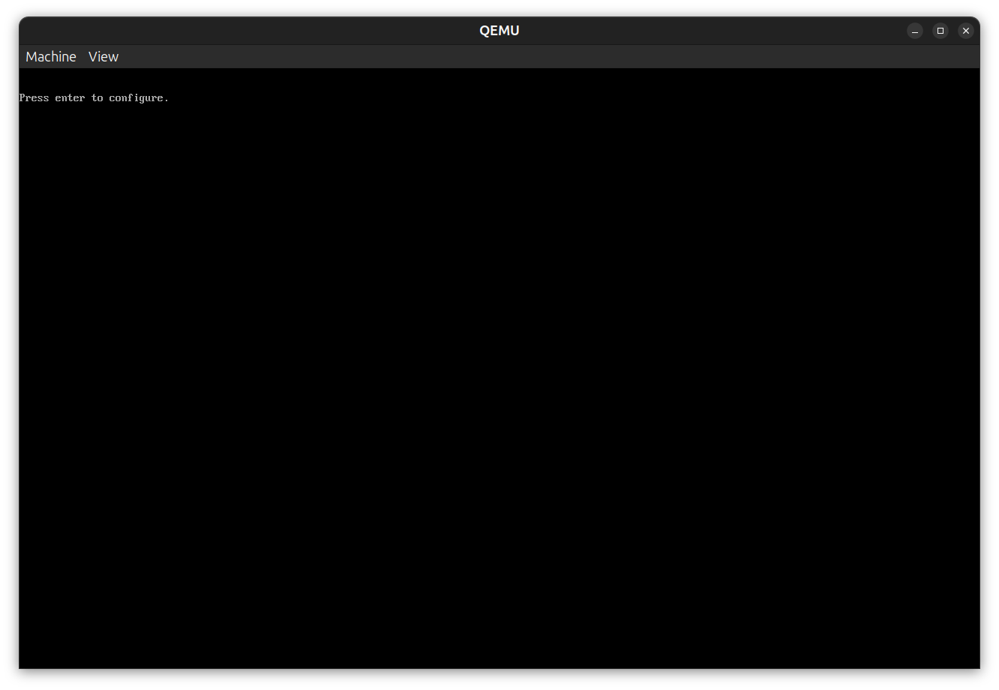
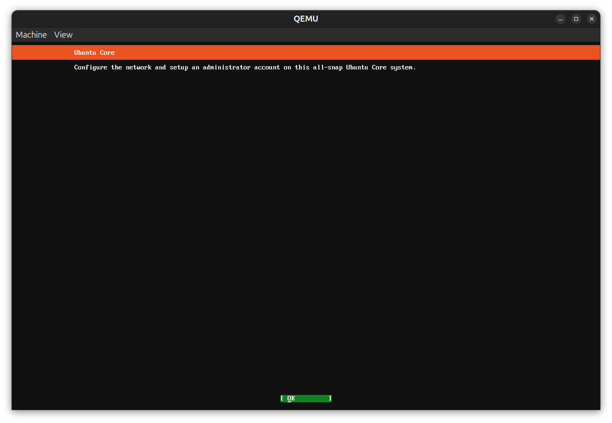
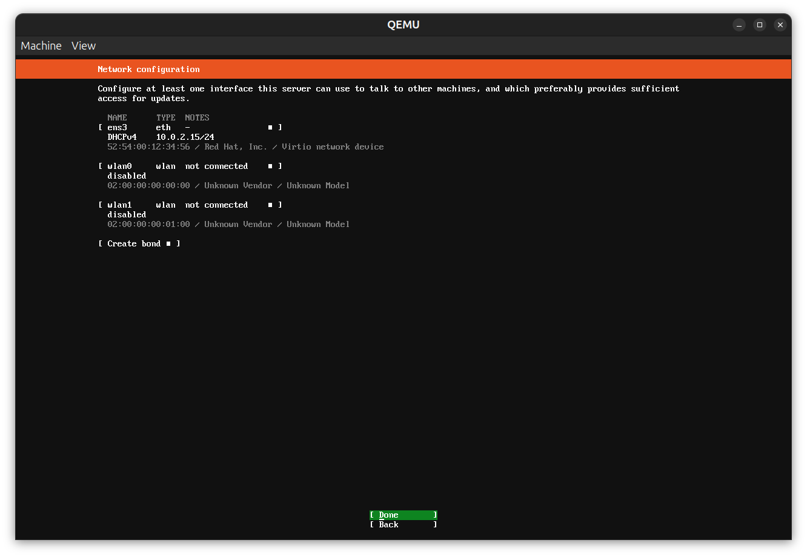
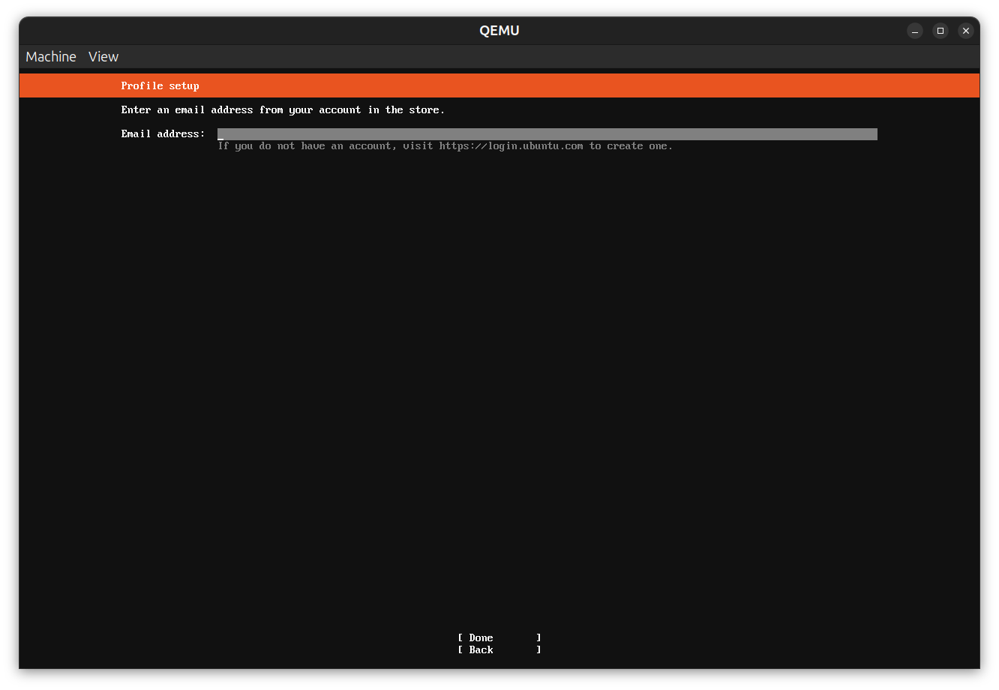
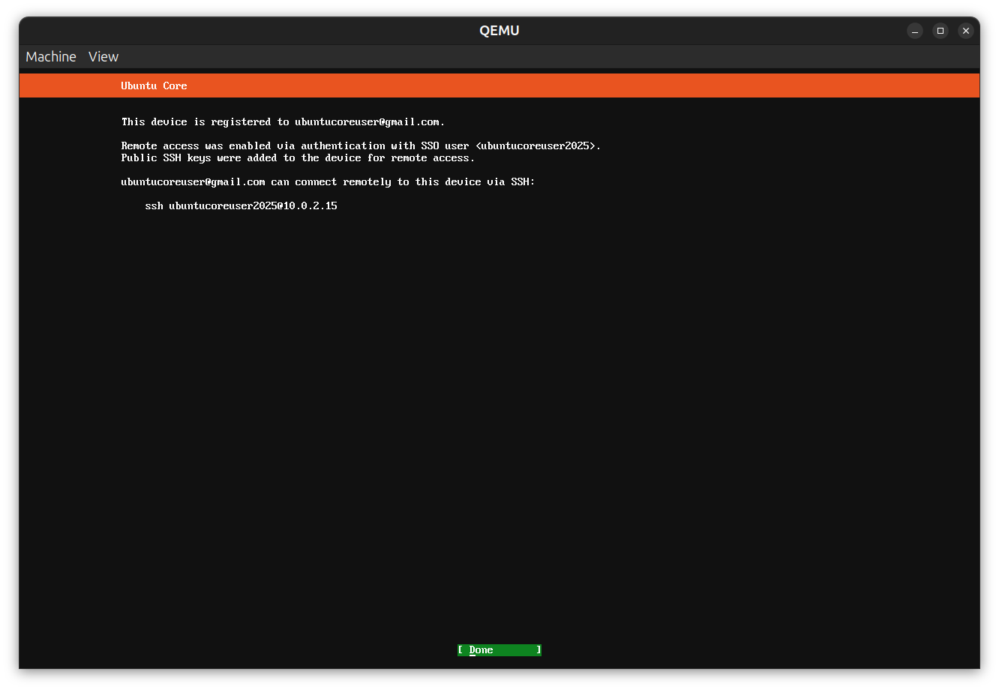
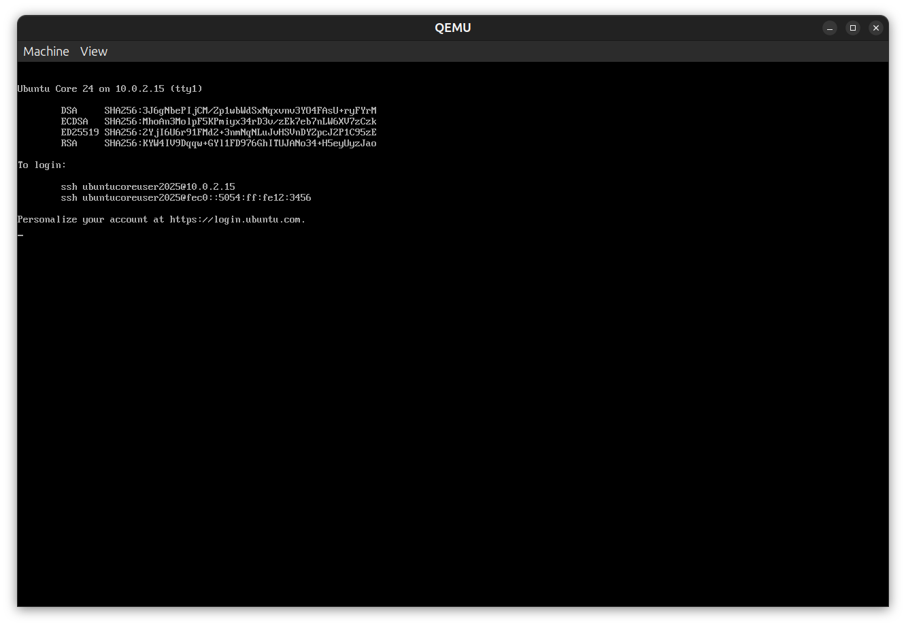

# Using console-conf

Ubuntu Core images that include console-conf will start a text-mode application when the
system starts for the first time:

After the application starts, we will see a message.

Then we will be allowed to configure networking for the device, using any ethernet or wifi devices detected. We also have the possibility of bonding them.

After this, we can add an administrator account to the image. The email needs
to be registered in [Ubuntu](https://login.ubuntu.com).

In the final step, console-conf will create a user in the device and pull the ssh keys registered in [Ubuntu](https://login.ubuntu.com/ssh-keys), so we can ssh into the device by using them.

From that point on, after rebooting we will see the registered user in the display:

