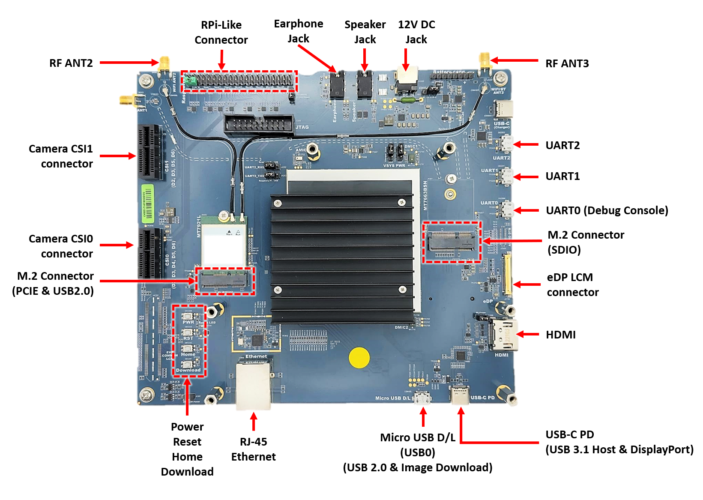
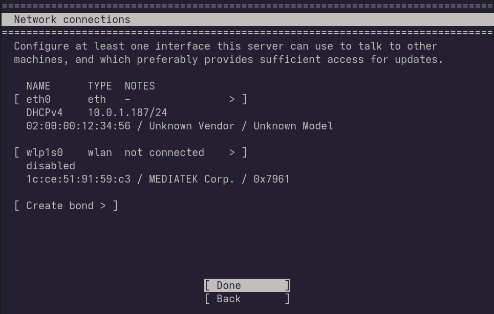
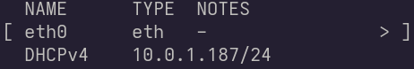
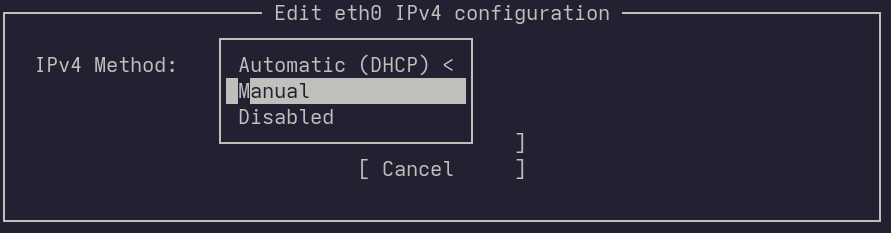
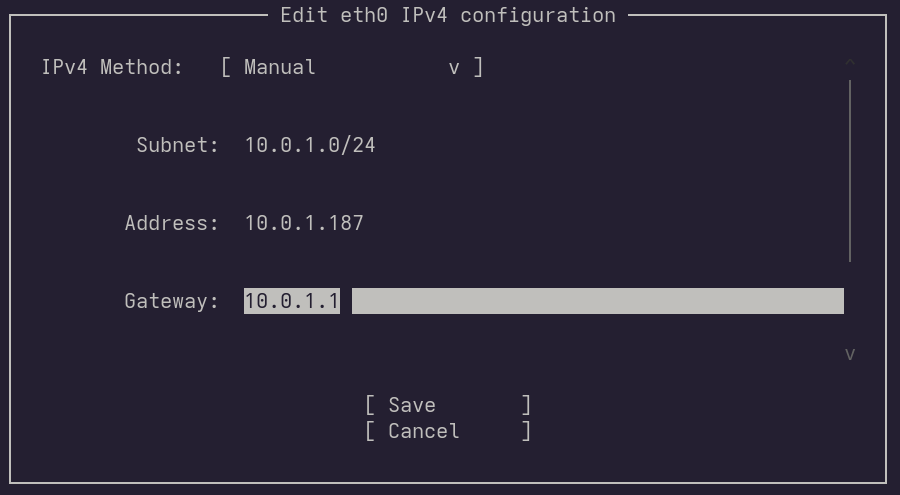
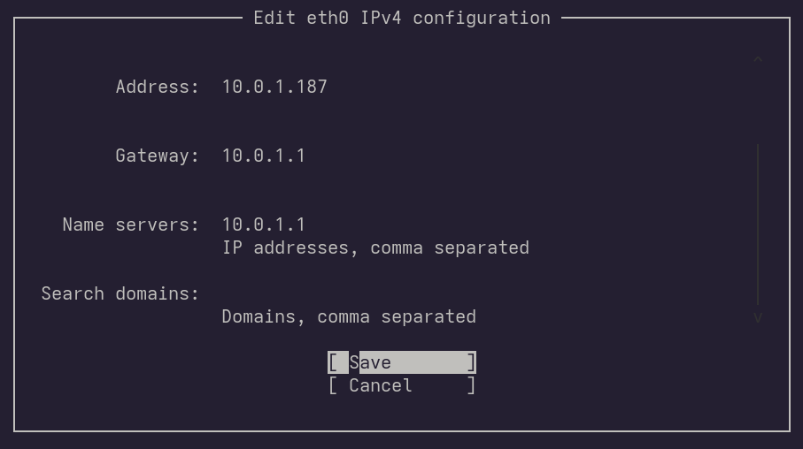

# Install a pre-build Ubuntu Core image on a MediaTek Genio Device

Pre-built images are ideal for exploration and experimentation of Ubuntu Core, but they are not intended for deployment or use at scale. They include snaps to provide an onboarding and evaluation experience, alongside an SSH connection, and these are unlikely to be required in your own Ubuntu Core deployment.

You can find more information about building Core images in the [Build your first image](/tutorials/build-your-first-image/index) tutorial.

Ubuntu Core runs on a large range of hardware, and pre-built images are available for the [MediaTek Genio](https://www.mediatek.com/products/iot/genio-iot).

You can follow these steps to install pre-build Ubuntu Core image onto your MediaTek Genio devices.

## Requirements

In addition to having a basic understanding of Linux and running commands from the terminal and an [Ubuntu One](tutorials/build-your-first-image/access-ubuntu-one) account, you will need the following:

For the used to write the images:
- [Ubuntu 24.04 LTS](https://releases.ubuntu.com/24.04/) or later installed
- Internet connectivity
- 10GB of free storage space
- A microUSB cable for UART
- Another microUSB cable for connect to flash interface
  - You need a USB type-c cable if your device is MediaTek Genio 1200
- An [Ubuntu SSO account with associated SSH keys](/how-to-guides/manage-ubuntu-core/use-ubuntu-one-ssh).

The target device:
- A [MediaTek Genio](https://www.mediatek.com/products/iot/genio-iot) device
- A 12V AC power adapter (Should be in the EVK package)

A pre-built Ubuntu Core image does not use a username and password to login to the system. It instead uses SSH and your public SSH key, which is uploaded to your Ubuntu One account. This is handled by the console-conf snap bundled in pre-built test images. SSH is otherwise not a requirement for Ubuntu Core images. See Connect to Ubuntu Core with SSH for further details.

## 1. Prepare genio-tools
   
[genio-tool](https://gitlab.com/mediatek/aiot/bsp/genio-tools) is a set of tools to flash, control or configure MediaTek boards, and in particular the Genio evaluation kits. We need it to flash image to your MediaTek Genio device.

1. Install genio-tool from snap
   ```
   sudo snap install genio-tools
   ```
2. Enable udev rules
   ```
   eval "$(snap run genio-tools.udev-script)"
   ```

   ```{tip}
   You may need to log out and log in as the current user to gain the new group permissions.
   ```

## 2. Get image and boot firmware

1. Download image

   Download the MediaTek Genio Ubuntu Core image here: [genio-core-22-20250423-201.tar.xz](https://people.canonical.com/~platform/images/mediatek/ubuntu-core-22/genio-core-22-20250423-201.tar.xz)

2. Download boot firmware

   Boot firmware is a series of files used to boot the operating system.
   According to your device model, you need to download boot firmware here:
   |Device Model|Link|
   |---|---|
   |Genio 1200 EVK|[ubuntu-boot-firmware-genio-1200-evk-v24.1-ubuntu1.tar.gz](https://download.mediatek.com/iot/download/ubuntu/boot-firmware/v24.1/ubuntu-boot-firmware-genio-1200-evk-v24.1-ubuntu1.tar.gz)|
   |Genio 700 EVK|[ubuntu-boot-firmware-genio-700-evk-v24.1-ubuntu1.tar.gz](https://download.mediatek.com/iot/download/ubuntu/boot-firmware/v24.1/ubuntu-boot-firmware-genio-700-evk-v24.1-ubuntu1.tar.gz)|
   |Genio 510 EVK|[ubuntu-boot-firmware-genio-510-evk-v24.1-ubuntu1.tar.gz](https://download.mediatek.com/iot/download/ubuntu/boot-firmware/v24.1/ubuntu-boot-firmware-genio-510-evk-v24.1-ubuntu1.tar.gz)|
   |Genio 350 EVK|[ubuntu-boot-firmware-genio-350-evk-v24.1-ubuntu1.tar.gz](https://download.mediatek.com/iot/download/ubuntu/boot-firmware/v24.1/ubuntu-boot-firmware-genio-350-evk-v24.1-ubuntu1.tar.gz)|

3. Extract all files into one directory

   ```bash
   tar -xf genio-core-22-20250423-201.tar.xz
   tar -xf ubuntu-boot-firmware-genio-1200-evk-v24.1-ubuntu1.tar.gz --strip-components=1 -C genio-core-22-20250423-201
   ```
   ```{note}
   Please replace `ubuntu-boot-firmware-genio-1200-evk-v24.1-ubuntu1.tar.gz` with the file name of the boot firmware you downloaded from the previous step.
   ```
   In this step, you will get a directory with these files:
   ```
   $ ls -l genio-core-22-20250423-201
   total 522696
   -rw-rw-r-- 1 ubuntu ubuntu    239360 Apr  8 02:24 bl2.img
   -rw-rw-r-- 1 ubuntu ubuntu  33554432 Apr  8 02:24 bootassets.vfat
   -rw-rw-r-- 1 ubuntu ubuntu   1929720 Apr  8 02:24 fip.bin
   -rw-r--r-- 1 ubuntu ubuntu  33554432 Apr 23 09:55 firmware.vfat
   -rw-rw-r-- 1 ubuntu ubuntu    264360 Apr  8 02:24 lk.bin
   -rw-rw-r-- 1 ubuntu ubuntu      3261 Apr  8 02:24 snapshot.xml
   -rw-rw-r-- 1 ubuntu ubuntu      3358 Apr  8 02:24 u-boot-initial-env
   -rw-r--r-- 1 ubuntu ubuntu 465672276 Apr 23 09:56 ubuntu.img
   -rw-r--r-- 1 ubuntu ubuntu      1031 Apr 23 09:48 ubuntu.json
   ```

## 3. Flash system image

   1. Run this command to flash the system image:

      ```
      $ genio-tools.genio-flash -e ethaddr="02:00:00:12:34:56"
      ```
      ```{attention}
      02:00:00:12:34:56 is just an example MAC address. If this is only for testing, you may replace the digits in the '12:34:56' portion with random hexadecimal digits. Please note that devices with identical MAC addresses on the same network will be unable to access the network properly.
      ```
   2. When you see this messages output from genio-tools:
      ```
      Genio Tools: v1.6.2
      Ubuntu Image:
              edition:  Ubuntu classic/core images
              version:  22.04
              codename: jammy
      
      ...
      You can now manually reset the board into DOWNLOAD mode.
      
      INFO:root:Continue flashing...
      ```

      Please connect your host to the "Image Download" port of the device with a USB cable. You can refer to the following image to find the Image Download port.

      ````{tabs}
   
      ```{tab} Genio 1200 EVK
   
      
      ```
   
      ```{tab} Genio 700 EVK
   
      
      ```
   
      ```{tab} Genio 510 EVK
   
      
      ```
   
      ```{tab} Genio 350 EVK
   
      
      ```
      ````
   3. Hold down "Download" button on device.

   4. Press "Reset".

   5. Release "Download" when this appears in genio-tools.
      
      ```text
      Looking for MediaTek SoC matching USB device 0e8d:0003
      Opening /dev/ttyACM0 using baudrate=115200
      Connected to MediaTek SoC: hw_code[0x8195]
      Sending bootstrap to address: 0x201000
      Jumping to bootstrap at address 0x201000 in AArch64 mode
      erasing mmc0
      < waiting for any device >
      Erasing 'mmc0'
      ```

   6. The device will start flashing. When flashing has been finished, genio-tools will output this and exit.
      
      ```text
      ...
      Finished. Total time: 2.449s
      Rebooting                                          OKAY [  0.002s]
      Finished. Total time: 0.252s
      ```
## Boot Ubuntu Core for the first time

You can now use a USB cable to connect to the UART0 port of the device. After that, you will have a new `ttyUSB*` (such as `/dev/ttyUSB0`) under the `/dev` directory.

The baudrate of the serial console is 921600. You can use your favorite serial console client to communicate with the new `ttyUSB0` device. For example, 

```bash
tio -b 921600 /dev/ttyUSB0
```

You might see typical Linux output on the screen, periods where there's just a flashing cursor, and messages like _Installing the system, please wait for a reboot_.  When this process has finished, you will see the following:

`Press enter to configure.`

Press **Enter**.

```{tip}
If you did not see any message in your serial console for several seconds, it may be because the system has already finished booting. You can just press Enter.
```

And then you will see a prompt that reads:

```text
Ubuntu Core
Configure the network and setup an administrator account on this all-snap
Ubuntu Core system.
```

Press **Enter** again and you will be taken to the network setup page:




## Configure a network connection

Network access is a requirement for Ubuntu Core, at least initially, and you have a choice about whether to use a wired connection (Ethernet) or Wi-Fi.

### Ethernet

If an Ethernet cable is connected to your device, a network connection will attempt to be automatically negotiated and, if this is successful, you will see an IP address for the device after the DHCPv4 entry in the _Network connections_ page. In this case, you don't need to do anything further:



To configure an Ethernet connection manually, select the eth0 device and select _Edit IPv4_ from the small menu that appears. By default, the network device will be configured to use _Automatic (DHCP)_, which is why the connection attempts to automatically configure itself. Press **Enter** to reveal two further options, _Manual_ and _Disabled_:



Selecting _Manual_ will allow you to configure your Ethernet connection manually by entering values for your subnet mask value (using CIDR `xx.xx.xx.xx/yy` notation), the static IP address of your device, the network gateway, and the name servers you wish to use:



Due to the size limitation of the serial console, not all information is shown on this screen. When you have finished entering the Gateway information, you need to press the Down key to continue entering the "Name Servers" and optional "Search domain" information.



Select **Save** to apply those changes and for the connection to be attempted. You can now proceed to the next step by pressing **Done**.

### Wi-Fi


To configure Wi-Fi, press the cursor up key until the wireless device (such as _wlan0_) is selected and press **Enter**. You will see a small menu and you need to select **Edit Wi-Fi**.


After selecting _Edit Wi-Fi_, you will see the network interface configuration panel for Wi-Fi. If you know the name of the Wi-Fi network you wish to connect to, it can be entered directly, or cursor down to _Choose a visible network_ and select a network from a list of those that have been detected.


Finally, enter the Wi-Fi password and select **Save** to complete the configuration. You will be returned to the previous menu and your device will attempt to connect to the network. If successful, you will see its IP address to the right of DHCPv4.


For advanced network configuration, such as setting a static IP address, select the wireless device again, and choose edit IPv4 from the menu.

When you've finished configuring your network settings, select **Done** and press enter on the _Network connections_ page to move on to the final step.

### Add Ubuntu SSO details

This is the final step before completing the Ubuntu Core setup and you simply need to enter the email address linked to your Ubuntu SSH account.


As mentioned earlier,  your account is used to link its registered SSH keys to the new device deployment and allow you to connect without any further device configuration.

With your username registered across the network, you will see a message similar to the following:

```
This device is registered to <ubuntu-sso-email-address>

Remote access was authenticated with SSO user <username>.
Public SSH keys were added to the device for remote access.

<ubuntu-sso-email-address> can connect remotely to this device via SSH:

ssh <username>@<ip-address>
```

Everything is now configured and you're ready to connect to the device.

## Connect to the device

If a display is connected, the network addresses and associated account username will be shown.

You can now connect to your Ubuntu Core machine with the _ssh_ command and your username followed by the IP address of your device:

`ssh <username>@<device ip address>`

For example:

```bash
$ ssh user@10.0.2.15
The authenticity of host '192.168.1.68 (192.168.1.68)' can't be established.
ED25259 key fingerprint is SHA256:VD5KH7hM5RxQ15mM70zyJvgmg.
This key is not known by any other names
Are you sure you want to continue connecting (yes/no/[fingerprint])? yes
Warning: Permanently added '192.168.1.68' (ED25259) to the list of known hosts.
[...]
This Ubuntu Core machine is a tiny, transactional edition of Ubuntu,
designed for appliances, firmware and fixed-function VMs.
```

As shown above, the first time you connect to a new device you will be asked to accept its authenticity. You can check the _ECDSA_ key fingerprint against the finger print shown on the screen after a first reboot. ECDSA is the second one listed.

Congratulations! You have successfully downloaded, installed, and connected to a pre-built Ubuntu Core image on your MediaTek Genio.

See [First steps with Ubuntu Core](/how-to-guides/using-ubuntu-core) for an introduction to using your new Ubuntu Core installation or learn how to [build your Ubuntu Core image](/tutorials/build-your-first-image/index).
